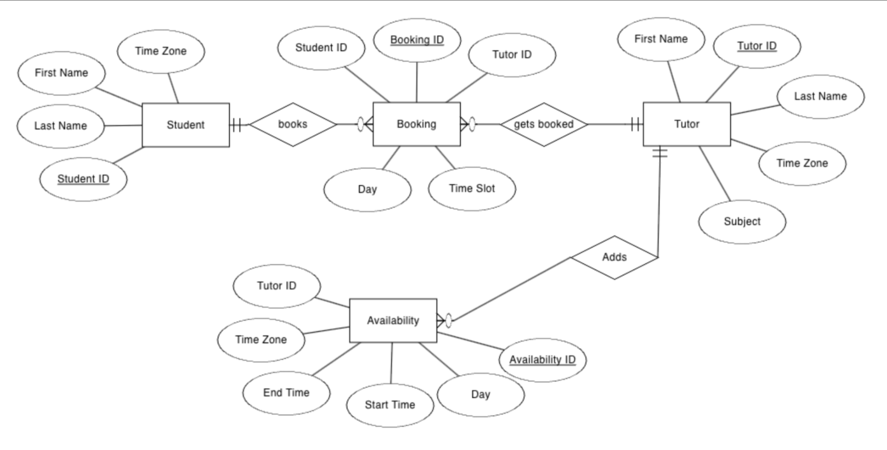

# Scheduling System

## Overview
This is a scheduling system designed to manage tutor availability and student bookings with full support for time zones. It allows tutors to set their availability, students to search for available tutors by subject, and book time slots in their preferred time zone. The system is designed to be scalable and extendable for future features such as notifications and payments.

---

## Features
1. **Tutor Availability Management**
   - Tutors can set recurring or one-time availability.
   - Time zone support ensures availability is shown accurately for students.

2. **Student Booking**
   - Students can search for tutors by subject and book available time slots.

3. **Time Zone Support**
   - The system converts tutor availability to the student’s time zone automatically.

---

## Database Schema
The database schema includes four main tables:
1. **Students**: Stores student details (`first_name`, `last_name`, `time_zone`).
2. **Tutors**: Stores tutor details (`first_name`, `last_name`, `subject`, `time_zone`).
3. **Availabilities**: Tracks tutor availability (`tutor_id`, `day`, `start_time`, `end_time`, `time_zone`).
4. **Bookings**: Records bookings between students and tutors (`student_id`, `tutor_id`, `day`, `time_slot`).

---

